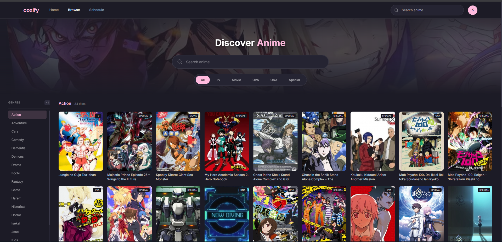
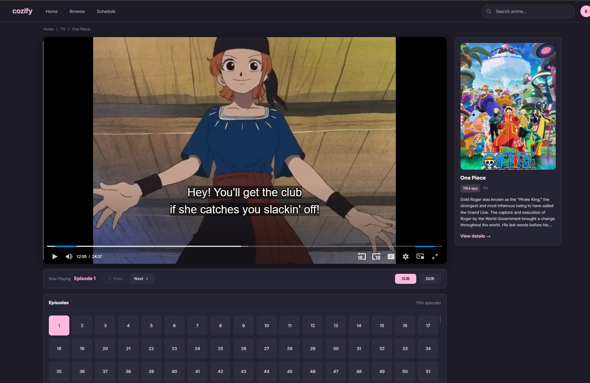
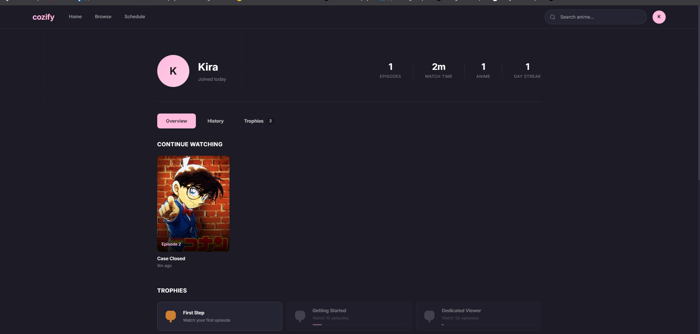

# Cozify

A modern anime streaming web application built with React. Cozify provides a seamless viewing experience with an elegant interface, intelligent video player, and comprehensive user tracking features.


---

## Demo

Live Demo: [https://kirazul.github.io/Cozify/](https://kirazul.github.io/Cozify/)

---

## Table of Contents

- [Overview](#overview)
- [Features](#features)
- [Tech Stack](#tech-stack)
- [API Reference](#api-reference)
- [Project Structure](#project-structure)
- [Getting Started](#getting-started)
- [Screenshots](#screenshots)
- [License](#license)

---

## Overview

Cozify is a single-page application designed for anime enthusiasts. It aggregates anime content through the YumaAPI, providing access to a vast library of anime series with both subbed and dubbed options. The application focuses on user experience with features like watch history tracking, achievement trophies, and an intelligent video player with automatic retry logic.

---

## Features

### Core Functionality
- Browse trending, top airing, and recently updated anime
- Search anime with real-time suggestions
- View detailed anime information including synopsis, rating, and episode list
- Stream episodes with SUB/DUB audio options
- Daily airing schedule

### Video Player
- Intelligent retry system with automatic server switching
- Cycles through 3 streaming servers (s-1, s-2, s-3)
- Automatic fallback from SUB to DUB (or vice versa) on failure
- 12-second load timeout with auto-retry
- Manual server and audio selection on error
- Keyboard shortcuts (F: fullscreen, N: next, P: previous, R: retry)

### User Profile System
- Welcome modal for first-time visitors
- Watch history tracking with continue watching feature
- Episode completion tracking (marks watched after 1 minute)
- Real-time watch time statistics
- Trophy achievement system with 4 tiers (Bronze, Silver, Gold, Platinum)
- Visual indicators for watched episodes

### Design
- Dark theme with signature pink accent (#ffbade)
- Glassmorphism UI elements
- Responsive layout for all screen sizes
- Smooth animations and transitions

---

## Tech Stack

| Technology | Purpose |
|------------|---------|
| React 18 | UI Framework |
| React Router DOM 6 | Client-side routing |
| Vite 5 | Build tool and dev server |
| HLS.js | HTTP Live Streaming support |
| CSS3 | Styling with custom properties |
| LocalStorage | Client-side data persistence |

---

## API Reference

Cozify uses the YumaAPI for fetching anime data. The API scrapes HiAnime.to in real-time.

### Base URL
```
/api
```

### Endpoints

| Endpoint | Description |
|----------|-------------|
| `/search/{query}` | Search anime by title |
| `/search-suggestions/{query}` | Get search autocomplete suggestions |
| `/info/{anime_id}` | Get detailed anime information and episode list |
| `/watch?episodeId={id}&type={sub\|dub}` | Get video streaming sources |
| `/recent-episodes` | Fetch recently updated episodes |
| `/top-airing` | Get current top airing anime |
| `/spotlight` | Get featured spotlight anime |
| `/genre/list` | List all available genres |
| `/genre/{genre_name}` | Get anime by genre |
| `/studio/{studio_id}` | Get anime by studio |
| `/schedule/{YYYY-MM-DD}` | Get airing schedule for a date |

### Video Streaming
Video playback uses embedded players from megaplay.buzz with the following URL structure:
```
https://megaplay.buzz/stream/{server}/{episode_number}/{audio_type}
```

---

## Project Structure

```
cozify/
├── public/
│   └── anw-min.webp          # Background image asset
├── src/
│   ├── api/
│   │   └── index.js          # API service layer
│   ├── components/
│   │   ├── Header.jsx        # Navigation header
│   │   ├── VideoPlayer.jsx   # Video player with retry logic
│   │   ├── AnimeCard.jsx     # Anime card component
│   │   ├── TrendingCarousel.jsx
│   │   ├── TopTen.jsx
│   │   └── WelcomeModal.jsx  # First-visit welcome modal
│   ├── pages/
│   │   ├── Home.jsx          # Landing page
│   │   ├── Browse.jsx        # Browse/search page
│   │   ├── Anime.jsx         # Anime detail page
│   │   ├── Watch.jsx         # Video watch page
│   │   ├── Schedule.jsx      # Airing schedule
│   │   └── Profile.jsx       # User profile and stats
│   ├── services/
│   │   └── userService.js    # LocalStorage user data management
│   ├── styles/
│   │   └── global.css        # Global styles and CSS variables
│   ├── App.jsx               # Root component with routes
│   └── main.jsx              # Application entry point
├── index.html
├── package.json
└── vite.config.js
```

---

## Getting Started

### Prerequisites
- Node.js 18 or higher
- npm or yarn

### Installation

1. Clone the repository
```bash
git clone <repository-url>
cd cozify
```

2. Install dependencies
```bash
npm install
```

3. Start the development server
```bash
npm run dev
```

4. Open your browser and navigate to `http://localhost:5173`

### Build for Production
```bash
npm run build
```

### Preview Production Build
```bash
npm run preview
```

---

## Screenshots

### Browse Page
Search and filter anime by genre, with grid layout display.



### Watch Page
Full-featured video player with episode grid, anime info panel, and playback controls.



### Profile Page
User statistics, watch history, continue watching section, and trophy achievements.



---

## Configuration

### Vite Configuration
The project uses Vite with React plugin. API requests are proxied through the dev server configuration in `vite.config.js`.

### Color Scheme
Primary accent color: `#ffbade` (Pink)
Background: Dark theme with glassmorphism effects

---

## License

This project is for educational purposes only. All anime content is provided through third-party APIs and streaming services.

---

## Acknowledgments

- YumaAPI for providing the anime data API
- HiAnime.to as the data source
- megaplay.buzz for video streaming infrastructure
